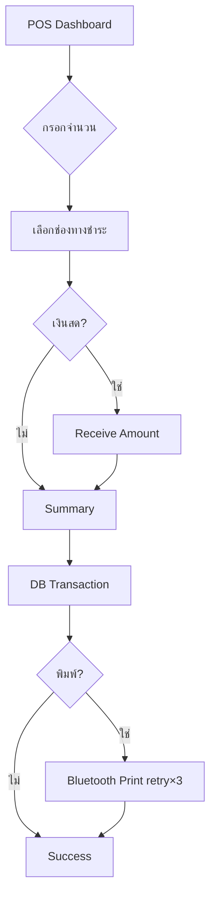

# FUEL POS — เอกสารระบบ

แอปพลิเคชัน Point of Sale สำหรับปั๊มน้ำมัน (Flutter) รองรับ Mobile & Tablet ภาษาไทย ทำงาน offline-first ด้วย SQLite พร้อม Bluetooth printer, TTS, backup และระบบ License แบบหลาย tier

---

## สารบัญ

1. [ภาพรวม](#ภาพรวม)
2. [โครงสร้างโปรเจกต์](#โครงสร้างโปรเจกต์)
3. [สถาปัตยกรรมและการไหลของข้อมูล](#สถาปัตยกรรมและการไหลของข้อมูล)
4. [ฐานข้อมูล](#ฐานข้อมูล)
5. [License และ Module Gating](#license-และ-module-gating)
6. [Flow การทำงานหลัก](#flow-การทำงานหลัก)
7. [ความเสถียรและความปลอดภัยของข้อมูล](#ความเสถียรและความปลอดภัยของข้อมูล)
8. [การทดสอบ (Testing)](#การทดสอบ-testing)
9. [CI/CD](#cicd)
10. [การรันและพัฒนา](#การรันและพัฒนา)

---

## ภาพรวม

| รายการ | รายละเอียด |
|--------|------------|
| ชื่อแอป | FUEL POS |
| เวอร์ชัน | 1.0.0+1 |
| Framework | Flutter (SDK ≥ 3.1) |
| Repository | [github.com/kridsadar357/fpos-mini](https://github.com/kridsadar357/fpos-mini) |
| State management | Provider (`ChangeNotifier`) |
| ฐานข้อมูล | SQLite (`sqflite`) schema v13 |
| UI | ภาษาไทย, responsive (mobile/tablet/landscape) |
| Default login | `admin` / `admin123` |

### ความสามารถหลัก

- ขายน้ำมันผ่านตู้จ่าย/มือจ่าย (บาท หรือ ลิตร)
- ขายสินค้าทั่วไป (Enterprise)
- เปิด/ปิดกะ, สรุปยอดกะ, audit log
- โปรโมชั่น, สต็อกสินค้า, คลังน้ำมัน
- พิมพ์ใบเสร็จ Bluetooth ESC/POS
- สำรอง/กู้คืนฐานข้อมูล, export CSV
- License แบบ Free / Standard / Pro / Enterprise

---

## โครงสร้างโปรเจกต์

```
fuel_pos/
├── lib/
│   ├── main.dart                    # Entry point, Provider, global error handler
│   ├── core/                        # ชั้น infrastructure
│   │   ├── constants/               # theme, app constants, license rules
│   │   ├── models/                  # shared models (e.g. license resolve)
│   │   ├── services/                # DB, backup, license, printer, TTS, session
│   │   ├── utils/                   # formatter, money, responsive, toast
│   │   └── i18n/                    # ข้อความ UI
│   ├── data/                        # ชั้นข้อมูล
│   │   ├── models/                  # entity models (Transaction, Shift, …)
│   │   └── repositories/            # CRUD + business queries
│   └── presentation/                # ชั้น UI
│       ├── providers/               # AppState (state รายการขายปัจจุบัน)
│       ├── screens/                 # หน้าจอหลัก + backend
│       └── widgets/                   # reusable components + dashboard panels
├── test/                            # unit / integration tests
├── assets/                          # รูป, font, เสียง
├── .github/workflows/               # CI (analyze + test)
└── pubspec.yaml
```

### ชั้น `core/`

| โมดูล | หน้าที่ |
|-------|---------|
| `database_service.dart` | SQLite singleton, migration, seed, transaction, backup verify |
| `backup_service.dart` | local backup, restore, cloud upload hook, CSV export |
| `license_service.dart` | verify Product Key, offline grace, tier sync |
| `bluetooth_printer_service.dart` | export ไป mobile/stub ตาม platform |
| `printer/printer_service_mobile.dart` | ESC/POS, retry 3 ครั้ง, timeout |
| `app_error_service.dart` | global error handler + log ไฟล์ |
| `auth_session_service.dart` | จำ user/shift ระหว่างเปิดแอป |
| `session_service.dart` | idle timeout 30 นาที |
| `money_utils.dart` | ปัดเงินเป็นบาทเต็ม (.00) |

### ชั้น `data/`

Repository pattern — UI เรียก repository ไม่ query DB โดยตรง

| Repository | หน้าที่ |
|------------|---------|
| `transaction_repository.dart` | ขายน้ำมัน/สินค้า (atomic DB transaction) |
| `shift_repository.dart` | เปิด/ปิดกะ, สรุปยอดกะ |
| `tank_repository.dart` | สต็อกถังน้ำมัน |
| `product_stock_repository.dart` | สต็อกสินค้า + movements |
| `promotion_repository.dart` | โปรโมชั่น |
| `fuel_repository.dart` | ประเภทน้ำมัน/ราคา |
| `dispenser_repository.dart` | ตู้จ่าย + มือจ่าย |
| `auth_repository.dart` | login, users |

### ชั้น `presentation/`

| กลุ่ม | ตัวอย่าง |
|-------|----------|
| POS หน้าร้าน | `pos_dashboard_screen`, `summary_screen`, `success_screen` |
| Backend (admin) | `backend_home_screen`, settings ต่างๆ |
| Onboarding | `splash_screen`, `setup_wizard_screen`, `login_screen` |
| Widgets | `sale_entry_panel`, `numpad_action_panel`, `close_shift_dialog` |
| State | `app_state.dart` — รายการขายที่กำลังทำ, promo, shift |

---

## สถาปัตยกรรมและการไหลของข้อมูล

```
┌─────────────┐     ┌──────────────┐     ┌─────────────────┐
│   Screens   │ ──► │  AppState    │     │  Repositories   │
│   Widgets   │ ◄── │  (Provider)  │     │                 │
└─────────────┘     └──────────────┘     └────────┬────────┘
                                                    │
                                                    ▼
                                           ┌─────────────────┐
                                           │ DatabaseService │
                                           │    (SQLite)     │
                                           └─────────────────┘
```

- **AppState** เก็บ state ชั่วคราวของรายการขาย (fuel, liters, payment, promo) — reset หลังขายเสร็จหรือ logout
- **Repositories** จัดการ persistence และ business rules
- **Services** จัดการ cross-cutting concerns (license, printer, backup)

### Startup flow

```
SplashScreen
  ├─ startupHealthCheck()     → ตรวจ schema DB
  ├─ TtsService.init()
  ├─ resolveLicenseOnStartup() → sync online หรือ offline grace
  ├─ tryRestoreLogin()        → กลับเข้า POS ถ้ามี session + shift เปิด
  └─ LoginScreen / SetupWizard
```

---

## ฐานข้อมูล

- ไฟล์: `fuel_pos_v2.db` (ใน app documents)
- Schema version: **13**
- Journal mode: WAL

### ตารางหลัก

| ตาราง | ใช้สำหรับ |
|-------|-----------|
| `users` | ผู้ใช้ (admin/cashier) |
| `fuel_types`, `tanks`, `dispensers`, `nozzles` | โครงสร้างปั๊ม |
| `transactions` | รายการขาย (fuel + product) |
| `shifts` | กะเปิด/ปิด |
| `products`, `product_stock_movements` | สินค้าและสต็อก |
| `promotions`, `discounts` | โปรโมชั่น |
| `customers` | ลูกค้า / ทะเบียนรถ / ใบกำกับ |
| `fuel_deliveries` | ประวัติรับน้ำมัน |
| `suspended_sales` | บิลที่พักไว้ |
| `settings` | key-value config |
| `audit_log` | บันทึกเหตุการณ์ |

### การขายแบบ Atomic

`TransactionRepository.create()` ใช้ `DatabaseService.runInTransaction()` ครอบ:

1. insert `transactions`
2. ตัดสต็อกถัง (nozzle → tank)
3. ตัดสต็อกสินค้าแถม (promo reward)
4. audit log

ถ้าขั้นตอนใดล้มเหลว → **rollback ทั้งหมด**

---

## License และ Module Gating

License tier กำหนดใน `lib/core/constants/license_features.dart`

| Feature | Free | Standard | Pro | Enterprise |
|---------|:----:|:--------:|:---:|:----------:|
| ปรับถัง manual | — | ✓ | ✓ | ✓ |
| คลังน้ำมันเต็ม + รับน้ำมัน | — | — | ✓ | ✓ |
| โปรโมชั่น | — | — | ✓ | ✓ |
| Cloud backup | — | — | ✓ | ✓ |
| ขายสินค้า / จัดการสินค้า / สต็อก | — | — | — | ✓ |

### การ verify License

- API: `https://ttmb-tech.com/license/api.php?product_id=KEY&action=verify`
- เก็บใน settings: `license_key`, `license_type`, `license_verified`, `license_last_verified_at`
- **Offline grace:** 7 วัน (ปรับได้ที่ `license_offline_grace_days`) — ใช้ cache เมื่อเชื่อมต่อ server ไม่ได้
- UI: General Settings → 「ตรวจสอบ License ใหม่」

การ gate module: `AppState.canUse(AppFeature.xxx)` + widget `LicenseGate`

---

## Flow การทำงานหลัก

### 1. Login + เปิดกะ

```
LoginScreen → AuthRepository.login()
           → OpenShiftDialog (ถ้ายังไม่มีกะเปิด)
           → PosDashboardScreen
```

### 2. ขายน้ำมัน

```
เลือกตู้จ่าย → เลือกมือจ่าย
  → กรอกจำนวน (บาท หรือ ลิตร)
  → [optional] เลือกลูกค้า / ฟลีทการ์ด
  → ชำระเงิน → เลือกช่องทาง
  → [เงินสด] ReceiveAmountScreen
  → SummaryScreen (auto apply promo)
  → ยืนยัน + พิมพ์ใบเสร็จ?
  → TransactionRepository.create() [atomic]
  → SuccessScreen
```

#### การปัดเงิน (บาทเต็ม)

เมื่อกรอก **ลิตร** ระบบคำนวณ `ลิตร × ราคา/ลิตร` แล้ว **ปัดขึ้นเป็นบาทเต็ม** (.00 เท่านั้น)

- Logic: `MoneyUtils` ใน `lib/core/utils/money_utils.dart`
- UI state: `AppState.subtotal`, `AppState.total`

### 3. ปิดกะ

```
Header POS → ปุ่ม 「ปิดกะ #xxx」
  → CloseShiftDialog (สรุปยอดกะ, แยกช่องทางชำระ, เงินในลิ้นชัก)
  → ยืนยันปิดกะ
  → เลือก: เปิดกะใหม่ / ออกจากระบบ
```

### 4. พิมพ์ใบเสร็จ

- Service: `BluetoothPrinterService` (mobile)
- Retry **3 ครั้ง**, reconnect ระหว่างครั้ง
- Timeout: connect 8s, write 12s
- ขายสำเร็จแม้พิมพ์ไม่ได้ (`printed=0`, พิมพ์ซ้ำได้จาก Success screen)

### 5. Backup / Restore

- Local backup → `backups/` ใน app documents (auto ทุก 24 ชม. หรือเมื่อ schema เปลี่ยน)
- Export ใช้ `VACUUM INTO` (ไฟล์ standalone ไม่ติด WAL)
- หลัง backup เรียก `verifyBackupFile()` — ไม่ผ่านจะลบไฟล์ทิ้ง
- Restore: validate → pre-restore backup → replace DB → verify schema
- **Auto-restore:** ถ้า startup health ล้มเหลว Splash แนะนำกู้คืนจาก backup ล่าสุดในเครื่อง
- **Backup health:** แจ้งเตือนถ้าไม่ได้สำรอง > `AppConstants.backupWarnDays` (3 วัน) — SnackBar บน POS + banner ในหน้าสำรองข้อมูล
- **Cloud backup (Pro+):** POST `https://ttmb-tech.com/license/backup/` — `multipart/form-data` field `file` + header `X-License-Token` (token จาก verify)

### 6. รับน้ำมันเข้าถัง / ปรับยอดถัง

- `FuelDeliveryRepository.confirmReceipt()` — อัปเดตถัง + สถานะ delivery + audit ใน DB transaction เดียว (rollback ทั้ง batch ถ้าบรรทัดใดล้ม)
- `TankRepository.manualAdjustStock()` — ปรับยอด manual พร้อม audit log (atomic)

---

## ความเสถียรและความปลอดภัยของข้อมูล

| กลไก | รายละเอียด |
|------|------------|
| DB transaction | ขายน้ำมัน/สินค้า, รับน้ำมันเข้าถัง, ปรับยอดถัง manual — atomic |
| Shift required | ขายต้องมี shift_id |
| Double-tap guard | ปุ่มยืนยันถูก disable ระหว่างบันทึก |
| Global error handler | `AppErrorService` → `app_errors.log` |
| Startup health | ตรวจ schema ก่อนใช้งาน; ล้มเหลว → แนะนำ restore |
| Backup verify + health | ตรวจไฟล์หลัง export; แจ้ง backup ล้าสมัย (> 3 วัน) |
| Cloud backup retry | multipart upload + X-License-Token, retry×3 |
| License grace | ทำงาน offline ได้ภายใน grace period (7 วัน) |
| Printer retry | ลด failure จาก Bluetooth ชั่วคราว (retry×3) |

---

## การทดสอบ (Testing)

### โครงสร้าง test

```
test/
├── helpers/
│   ├── test_database.dart    # sqflite_ffi + isolated DB ต่อ test
│   └── test_fixtures.dart    # seed user, tank, nozzle, shift, supplier, product, promo
├── money_utils_test.dart     # ปัดเงินบาทเต็ม
├── app_state_test.dart       # liter/baht mode, change
├── sale_shift_flow_test.dart # ขาย → สรุปกะ → ปิดกะ, rollback
├── fuel_import_flow_test.dart # รับน้ำมันเข้าถัง atomic + rollback
├── product_promo_flow_test.dart # ขายสินค้า + โปรแถมสินค้า
├── shift_summary_test.dart   # สรุปแยกช่องทางชำระ
├── backup_flow_test.dart     # backup verify + backup health stale/recent
├── license_grace_test.dart   # offline grace logic
└── widget_test.dart          # AppLogo widget
```

### รัน tests

```bash
# ทั้งหมด (ต้อง concurrency=1 เพราะใช้ DB singleton ร่วมกัน)
flutter test --concurrency=1 test/

# รายไฟล์
flutter test test/sale_shift_flow_test.dart
```

### สิ่งที่ tests ครอบคลุม

| Test file | ครอบคลุม |
|-----------|-----------|
| `money_utils_test.dart` | ceil/floor baht, fuel subtotal |
| `app_state_test.dart` | UI state ปัดเงิน liter/baht |
| `sale_shift_flow_test.dart` | atomic sale, tank deduct, shift close, rollback, shift required |
| `fuel_import_flow_test.dart` | confirmReceipt เพิ่มสต็อก, rollback เมื่อเกินความจุ |
| `product_promo_flow_test.dart` | ขายสินค้า cart, โปรแถมสินค้า, rollback stock |
| `shift_summary_test.dart` | CASH/QR aggregation, drawer cash |
| `backup_flow_test.dart` | VACUUM backup valid, reject corrupt, backup health |
| `license_grace_test.dart` | grace window calculation |
| `widget_test.dart` | branding widget |

**รวม 28 tests** — รันด้วย `flutter test --concurrency=1 test/`

### Test infrastructure

`DatabaseService.configureForTesting()` / `resetForTesting()` — ชี้ DB ไปไฟล์ชั่วคราว (ใช้ใน test เท่านั้น)

```dart
// ตัวอย่าง pattern ใน test
setUp(() async => setUpTestDatabase());
tearDown(() async => tearDownTestDatabase());
```

---

## CI/CD

GitHub Actions: `.github/workflows/flutter_ci.yml`  
Repository: https://github.com/kridsadar357/fpos-mini

Trigger: push/PR ไป `main`, `master`, `develop`

```yaml
flutter pub get
flutter analyze --no-fatal-infos
flutter test --concurrency=1 [test files…]
```

---

## การรันและพัฒนา

### Prerequisites

- Flutter SDK ≥ 3.13
- Xcode (iOS) / Android Studio (Android)

### คำสั่ง

```bash
flutter pub get
flutter run
flutter analyze
flutter test --concurrency=1 test/
```

### Hot Restart

หลังแก้ logic สำคัญ (license, DB, AppState) แนะนำ **Hot Restart** ไม่ใช่ Hot Reload

### หมายเหตุการพัฒนา

- **อย่า** `flutter clean` บน Desktop project ถ้าไม่จำเป็น
- iOS: หลีกเลี่ยง `xattr -cr .` ทั้งโปรเจกต์
- Default admin: `admin` / `admin123` (เปลี่ยนใน production)

---

## แผนภาพ Flow ขาย (ย่อ)



---

*เอกสารนี้อ้างอิง codebase ณ schema v13 — อัปเดตเมื่อมี migration หรือ feature ใหม่*

**ดู also:** [คู่มือการใช้งาน (USER_MANUAL.md)](docs/USER_MANUAL.md)
